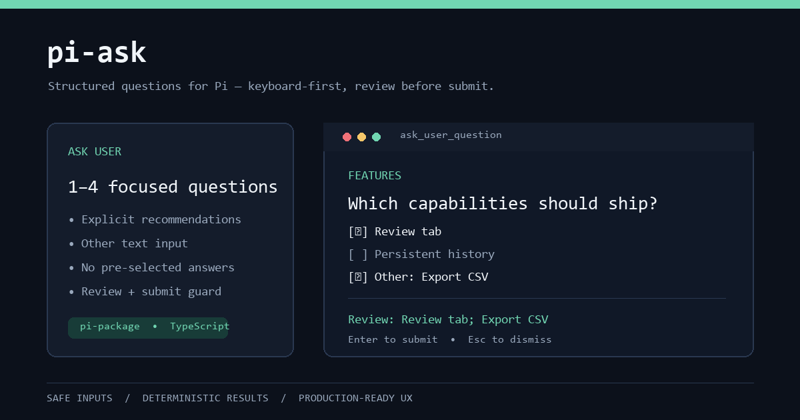

# pi-ask

Interactive keyboard-first questionnaire for [Pi Coding Agent](https://github.com/earendil-works/pi). Presents the user 1–4 structured questions with options, custom answers, and a **review tab** before final submission.



Inspired by the `AskUserQuestion` tool from Claude Code / OpenCode / Codex CLI.

## Install

```bash
# Install from a local directory (development)
pi install ./

# Or install from a Git repository
pi install git:github.com/your-username/pi-ask

# Or your project's .pi/settings.json
```

**Prerequisites:** Pi `>=0.80.7`.

## What it looks like

The tool (`ask_user_question`) makes the LLM pause and show a keyboard-driven dialog:

- **Questions tab** — each question has a header, optional context, and 2–4 options
- **Recommended** — options marked `recommended: true` show a `(Recommended)` hint; they are never pre-selected
- **Other** — pick "Other — add your own answer" to enter free text via the inline editor
- **Multi-select** — `Space` to toggle, `Enter` to confirm
- **Review tab** — see all answers before submitting; navigate back to any tab to edit
- **Keyboard navigation** — `↑↓` move, `Enter` confirm, `Space` toggle, `←→`/`Tab` switch tabs, `Esc` dismiss

### Tool call (transcript)

```
ask_user_question 2 questions (Storage, UI)
  ↓
✓ Storage: Tool details
✓ UI: Review tab, Custom answer
```

## Usage for the LLM

When facing ambiguity, the model calls `ask_user_question`. Example:

```json
{
  "questions": [
    {
      "id": "persistence",
      "header": "Persist",
      "question": "How should session state be persisted?",
      "context": "Answers must survive pi /tree and /fork operations.",
      "multiSelect": false,
      "options": [
        { "value": "details", "label": "Tool result details", "recommended": true },
        { "value": "file",    "label": "File" },
        { "value": "env",     "label": "Environment variable" }
      ]
    }
  ]
}
```

**Rules:**
- `id` must be unique per question; `value` must be unique per option
- Use `recommended: true` on the best option (shown as a hint; user must select it explicitly)
- Do **not** include a custom "Other" option — it is automatic
- `header` ≤ 12 characters
- Free-text Other answers are capped at 4,000 characters; terminal control characters are removed

## Key bindings

| Key | Context | Action |
|-----|---------|--------|
| `↑` `↓` | Options list | Move cursor |
| `Enter` | Single-select option | Confirm |
| `Space` | Option row | Select single option / toggle multi-select option |
| `Enter` | Selected options | Confirm question |
| `Enter` / `Space` | "Other — add your own answer" | Open inline editor |
| `Enter` | Inline editor (with text) | Save and close |
| `Esc` | Inline editor | Cancel |
| `←` `→` / `Tab` | Multi-question tabs | Switch tabs |
| `Enter` | Review tab | Submit all |
| `Esc` | Anywhere | Cancel / dismiss |

## Submission guarantees

- An unanswered question can be visited in Review but cannot be submitted; `Enter` is a no-op until every question is confirmed.
- Multi-select with no checked option and no Other text cannot be confirmed.
- Saving blank Other text clears it. If that leaves no answer, the question becomes unconfirmed and blocks Submit.
- Editing a selected answer or Other text unconfirms that question until the user confirms it again.
- Multi-select answers are serialized in the original option order, regardless of the order in which options were toggled.
- A submitted answer may carry `selectedValues` and `customText` together; the LLM transcript preserves both.
- Terminal exit/abort, user dismissal, invalid input, and unavailable UI have distinct result statuses: `aborted`, `dismissed`, `invalid`, and `unavailable`.

## Architecture

```
src/
├── index.ts       # Tool registration, non‑TUI fallback, renderCall/renderResult
├── schema.ts      # TypeBox schemas + validation
├── state.ts       # Reducer: navigation, selection, confirm, toResult
├── component.ts   # QuestionnaireComponent (pi-tui, no pi-coding-agent import)
tests/
├── state.test.ts      # reducer and result-contract tests
├── component.test.ts  # keyboard and rendering tests
└── tool.test.ts       # runtime validation and lifecycle tests
```

Key design decisions:

1. **Built-in "Other" row** — Pi's LLM should not add its own "Other" option; the component adds "Other — add your own answer" automatically. For multi-select questions, the custom text supplements selected options.
2. **Result by question ID, not text** — answers map via stable `questionId`/`value`, avoiding duplicate-text collisions.
3. **State in tool result `details`** — answers persist in the Pi session JSONL via built-in `toolResult.details`. Branch tracking is automatic: `/tree` or `/fork` uses the correct branch's answers. No `appendEntry`, no external state.
4. **Non-TUI = disabled** — in `ctx.mode !== "tui"`, returns `status: "unavailable"` and deactivates itself so the model won't retry.
5. **Keyboard-first WCAG** — all actions work with `↑↓ Enter Space Esc ←→`; no mouse dependency; color is never the sole indicator.
6. **No dead rendering** — `render()` caches by width and invalidates on state/theme change.
7. **TUI-only custom component** — `ctx.ui.custom()` opens only in `ctx.mode === "tui"`; RPC, JSON, and print modes return an explicit `unavailable` result.
8. **Terminal and IME safety** — rendered lines are clamped to the supplied display width; the questionnaire forwards focus to its inline `Editor` for IME-aware terminals.

## Reliability

`npm run check` covers reducer invariants, keyboard flows, review navigation, Other editing, narrow terminal widths, runtime validation, non-TUI fallback, and aborts before and after opening the dialog. The package tarball includes only runtime source and release metadata.

GitHub Actions runs this check, a production dependency audit, package dry-run, and a clean tarball-install smoke test on Node 20 and 22.

Implementation choices are verified against:

- Pi extension API and lifecycle: https://github.com/earendil-works/pi/blob/main/packages/coding-agent/docs/extensions.md
- Pi custom-component, focus, keyboard, and width contract: https://github.com/earendil-works/pi/blob/main/packages/coding-agent/docs/tui.md
- Reference questionnaire test coverage: https://github.com/ghoseb/pi-askuserquestion
- Alternative `ask` contract (free text, review disposition, dismissal): https://github.com/IgorWarzocha/howaboua-pi-stuff/tree/main/packages/pi-ask

## Pi package gallery readiness

[pi.dev/packages](https://pi.dev/packages) indexes npm packages tagged with the `pi-package` keyword; it does not accept a separate package upload. This package is prepared with the required keyword and its preview asset is hosted at a stable GitHub URL through `pi.image` in `package.json`. It will appear in the gallery only after a future npm publish.

## Development

```bash
npm install
npm test                 # unit and integration tests
npm run typecheck        # tsc --noEmit
npm run lint             # biome check
npm run pack:dry         # verify package contents
```

Test interactively:

```bash
pi -e ./src/index.ts --model sonnet
```

## Replacing the old package

If you previously installed `git:github.com/ghoseb/pi-askuserquestion`:

```bash
pi remove git:github.com/ghoseb/pi-askuserquestion
pi install git:github.com/your-username/pi-ask
```

Both packages register the `ask_user_question` tool — they conflict.

## License

MIT
